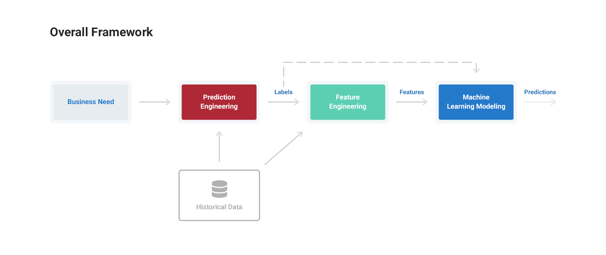
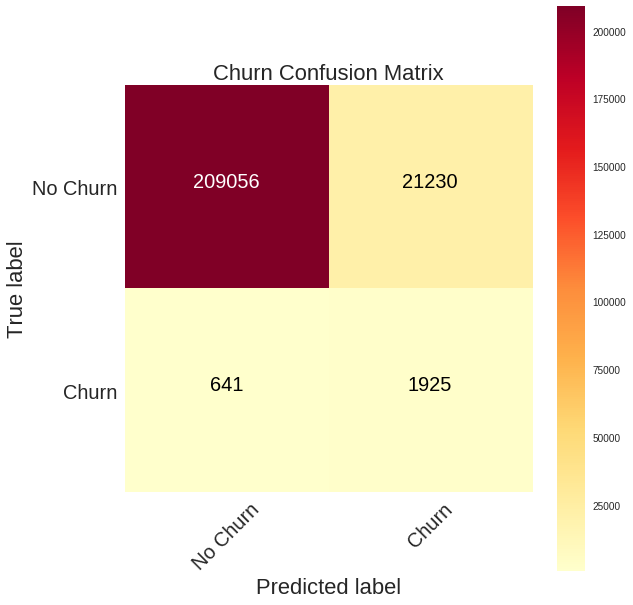
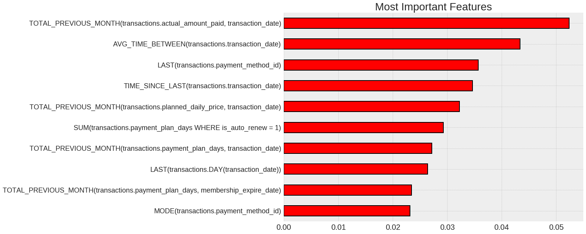
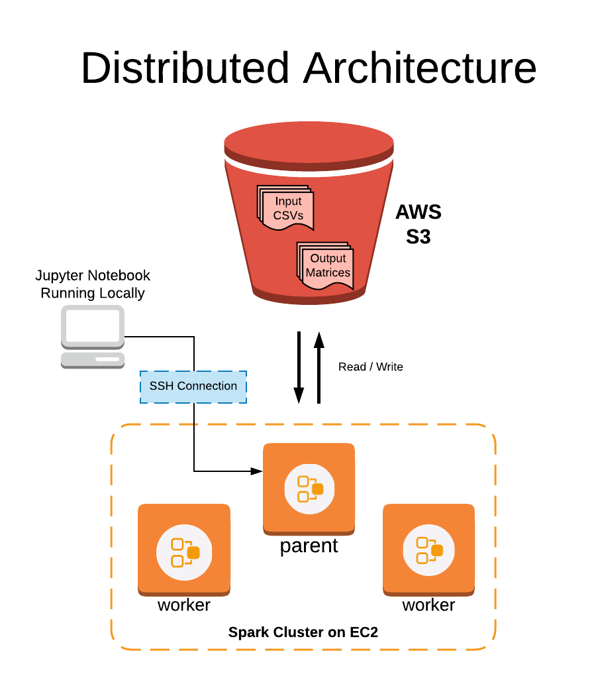

# A Machine Learning Framework with an Application to Predicting Customer Churn

This project demonstrates applying a 3 step general-purpose framework to solve problems with machine learning. The purpose of this 
framework is to provide a scaffolding for rapidly developing machine learning solutions across industries and datasets.

The end outcome is a both a specific solution to a customer churn use case, with a reduction in revenue lost to churn of more than 10%, 
as well as a general approach you can use to solve your own problems with machine learning. 

# Framework Steps

1. __Prediction engineering__
  * State business need
  * Translate business requirement into machine learning task by specifying problem parameters
  * Develop set of labels along with cutoff times for supervised machine learning
2. __Feature Engineering__
  * Create features - predictor variables - out of raw data 
  * Use cutoff times to make valid features for each label
  * Apply automated feature engineering to automatically make hundreds of relevant, valid features 
3. __Modeling__
  * Train a machine learning model to predict labels from features
  * Use a pre-built solution with common libraries
  * Optimize model in line with business objectives

Machine learning currently is an ad-hoc process requiring a custom solution for each problem. Even for the same dataset,
a slightly different prediction problem requires an entirely new pipeline built from scratch. This has made it too difficult for many 
companies to take advantage of the benefits of machine learning. The standardized procedure presented here will make it easier to solve 
meaningful problems with machine learning, allowing more companies to harness this transformative technology.

# Application to Customer Churn

The notebooks in this repository document a step-by-step application of the framework to a real-world use case and dataset - predicting
customer churn. This is a critical need for subscription-based businesses and an ideal application of machine learning. 

The dataset is provided by KKBOX, Asia's largest music streaming service, and can be downloaded [here](https://www.kaggle.com/c/kkbox-churn-prediction-challenge/data).

Within the overall scaffolding, several standard data science toolboxes are used to solve the problem:

* [Featuretools](https://docs.featuretools.com/#): automated feature engineering
* [Pandas](https://pandas.pydata.org): data munging and engineering
* [Scikit-Learn](http://scikit-learn.org/stable/documentation.html): standard machine learning algorithms
* [Apache Spark](https://spark.apache.org/documentation.html) with [PySpark](https://spark.apache.org/docs/latest/api/python/index.html): Running comptutations in parallel
* [TPOT (Tree-based Pipeline Optimization Tool)](https://github.com/EpistasisLab/tpot): model selection optimization using genetic algorithms

# Results

The final results comparing several models are shown below:

| Model                                     | ROC AUC | Recall | Precision | F1 Score |
|-------------------------------------------|---------|--------|-----------|----------|
| Naive Baseline (no ml)                    | 0.5     | 3.47%  | 1.04%     | 0.016   |
| Logistic Regression                       | 0.577   | 0.51%  | 2.91%     | 0.009   |
| Random Forest Default                     | 0.929   | 65.2%  | 14.7%     | 0.240   |
| Random Forest Tuned for 75% Recall        | 0.929   | 75%    | 8.31%     | 0.150    |
| Auto-optimized Model                      | 0.927   | 2.88%  | 64.4%     | 0.055   |
| Auto-optimized Model Tuned for 75% Recall | 0.927   | 75%    | 9.58%     | 0.170    |

__Final Confusion Matrix__

__Feature Importances__

# Notebooks

1. [Partitioning Data](https://github.com/Featuretools/predict-customer-churn/blob/master/churn/1.%20Partitioning%20Data.ipynb): separate data
into independent subsets to run operations in parallel.
2. [Prediction Engineering](https://github.com/Featuretools/predict-customer-churn/blob/master/churn/2.%20Prediction%20Engineering.ipynb): create labels based on the business need and historical data.
3. [Feature Engineering](https://github.com/Featuretools/predict-customer-churn/blob/master/churn/3.%20Feature%20Engineering.ipynb): implement
automated feature engineering workflow using label times and raw data
4. [Feature Engineering on Spark](https://github.com/Featuretools/predict-customer-churn/blob/master/churn/4.%20Feature%20Engineering%20on%20Spark.ipynb): parallelize feature engineering calculations by 
distributing across multiple machines
5. [Modeling](https://github.com/Featuretools/predict-customer-churn/blob/master/churn/5.%20Modeling.ipynb): develop machine learning
algorithms to predict labels from features; use automated genetic search tools to search for best model.

# Feature Engineering with Spark

To scale the feature engineering to a large dataset, the data was partitioned and automated feature engineering was run in parallel
using Apache Spark with PySpark. 

Featuretools supports scaling to multiple cores on one machine natively or to multiple machines using a Dask cluster. However, this
approach shows that Spark can also be used to parallelize feature engineering resulting in reduced run times even on large datasets.

The notebook [Feature Engineering on Spark](https://github.com/FeatureLabs/customer-churn/blob/master/churn/4.%20Feature%20Engineering%20on%20Spark.ipynb) demonstrates the procedure. The article [Featuretools on Spark](https://medium.com/feature-labs-engineering/featuretools-on-spark-e5aa67eaf807) documents the approach.

## Feature Labs

Featuretools is an open source project created by [Feature Labs](https://www.featurelabs.com/). To see the other open source projects we're working on visit Feature Labs [Open Source](https://www.featurelabs.com/open). If building impactful data science pipelines is important to you or your business, please [get in touch](https://www.featurelabs.com/contact.html).

### Contact

Any questions can be directed to help@featurelabs.com
