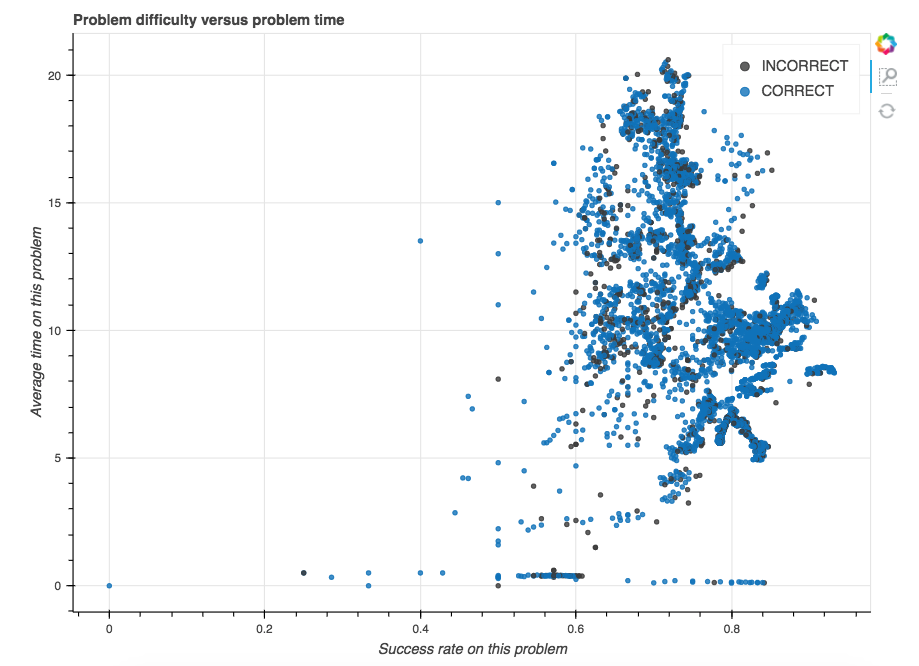

# Predicting Correct Answers

In this tutorial, we show how to predict whether a student will succesfully answer a problem using a dataset from [CMU DataShop](https://pslcdatashop.web.cmu.edu/). While online courses are logistically efficient, the structure can make it more difficult for a teacher to understand how students are learning in their class. To try to fill in those gaps, we can apply machine learning.  

You can find this tutorial on the Featuretools [site](https://www.featuretools.com/project/predict-correct-answer/).

*If you're running the notebook yourself, please download the [geometry dataset](https://pslcdatashop.web.cmu.edu/DatasetInfo?datasetId=76) into the `data` folder in this repository. You will only need the `.txt` file. The infrastructure in that notebook will work with **any** DataShop dataset, but you will need to change the filename to the dataset you'd like to load.*

## Highlights
* Show how to import a DataShop dataset into featuretools
* Demonstrate efficacy of automatic feature generation by training a machine learning model
* Give an example of how Featuretools can reveal and help answer interesting questions

Here is a plot of two automatically generated features:

This is an image of the average time spent on a problem versus the success rate on a given problem. There is an [interactive version](https://www.featuretools.com/wp-content/uploads/2018/03/difficulty_vs_time.html) of this plot which lets you hover over individual points to see the problem and problem step. Notice that the success rate on problems that take longer is uniformly lower for this dataset.

You can download the geometry dataset from [the datashop website](https://pslcdatashop.web.cmu.edu/DatasetInfo?datasetId=76) (free account required). Follow this [instructions](https://pslcdatashop.web.cmu.edu/help?datasetId=76&page=export) to download the data. Take the `.txt` file from the zipped download and place it in the `data` folder in this repository.

*Note: The notebook relies on a `datashop_to_entityset` function which is described in depth in the [entityset_function notebook](entityset_function.ipynb).*

## Feature Labs

Featuretools is an open source project created by [Feature Labs](https://www.featurelabs.com/). To see the other open source projects we're working on visit Feature Labs [Open Source](https://www.featurelabs.com/open). If building impactful data science pipelines is important to you or your business, please [get in touch](https://www.featurelabs.com/contact/).

### Contact

Any questions can be directed to help@featurelabs.com
