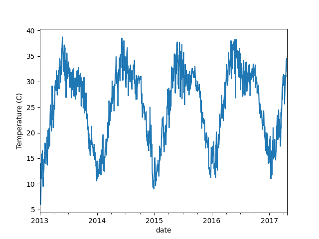
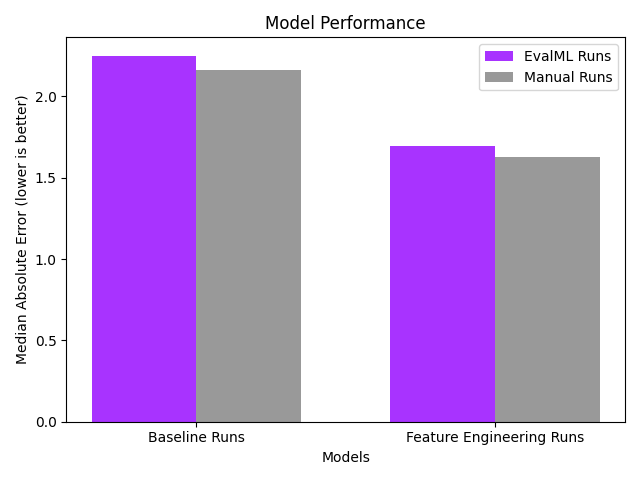

# Predicting Daily Temperature

In this tutorial, we show how Featuretools and EvalML can be used to automate time series forecasting by predicting future daily temperatures using historical daily temperature data.

We’ll use the DailyDelhiClimate dataset, which is a combination of the [Kaggle daily climate](https://www.kaggle.com/diegozurita/daily-climate-time-series) train and test data, since we'll be handling data splitting ourselves. This dataset in this tutorial only contains two columns--a time index and a target daily temperatures column.

Solving this problem as a univariate time series problem lets us build a rich set of features and a useful machine learning model. We can automate the process using both [Featuretools](https://www.featuretools.com) for time series feature engineering and [EvalML](https://github.com/alteryx/evalml) for performing automated time series regression.

We'll demonstrate several end-to-end workflows, starting with a baseline notebook, then moving to one where we build our features using Featuretools, and finally handling everything inside of EvalML.

## Highlights

- Quickly make end-to-end workflow using time series data and time series modeling concepts
- Show the impact that Feturetools' time series feature engineering has on model performance
- Use EvalML's AutoMLSearch to perform automated time series machine learning

## Results

The results of the three pipelines built in this tutorial can be seen below. Overall, we see that models that employ more specialized feature engineering can perform better than baseline models, and we can achieve similar results using both Featuretools and EvalML.

Featuretools provides a high level of customizability at the feature engineering step, and allows users to generate a wide array of time series features that can be specific to their use case. On the other hand, EvalML simplifies the entire modeling process from feature engineering to generating multiple pipelines to providing different ways of analyzing model performance.

## Running the tutorial

The data can be found in the `dataset` directory, so the notebook can be run without having to download any additional data.

## Alteryx

This is a demo created & maintained by [Alteryx](https://www.alteryx.com). It uses **Featuretools** and **EvalML**, which are open source libraries maintained by Alteryx. To see the other open source projects we’re working on visit [Alteryx Open Source](https://www.alteryx.com/open-source). If building impactful data science pipelines is important to you or your business, please [get in touch](https://www.alteryx.com/contact-us/).
